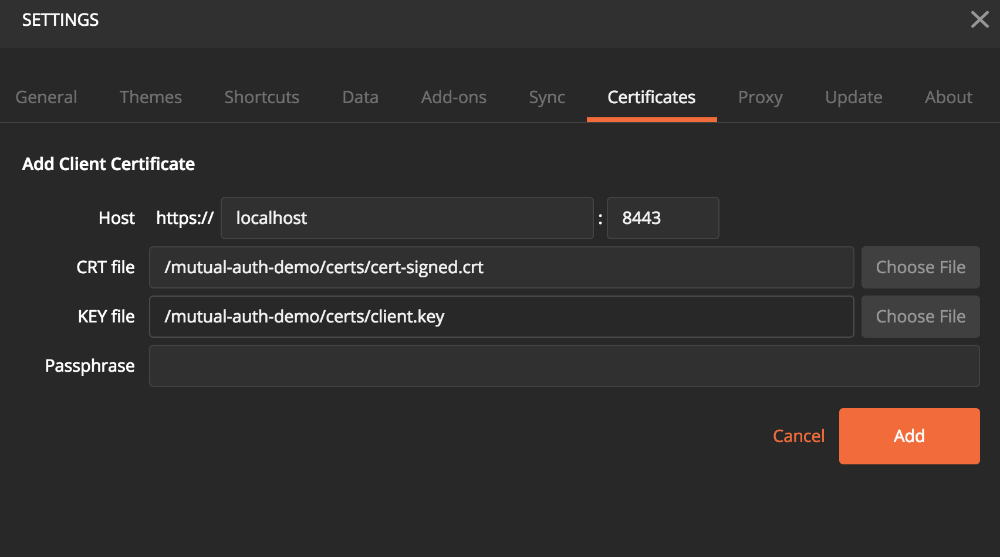
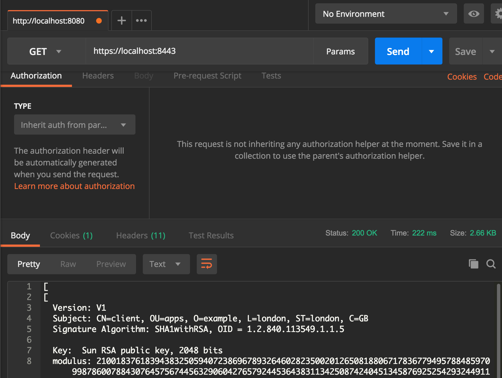
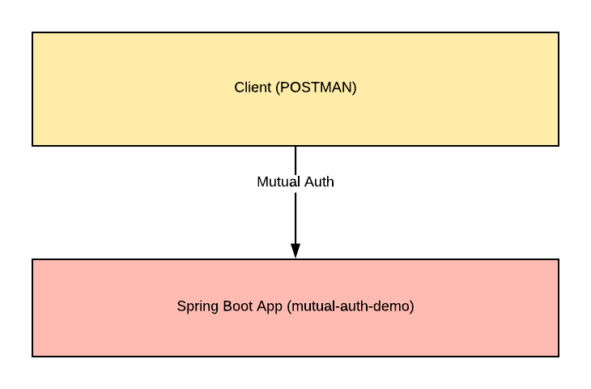

# mutual-auth-demo
Demo using spring boot 2 for mutual (X.509) authentication.

### Generating Client Certificates

1. Generate the client keystore: ``` keytool -genkey -alias bmc -keyalg RSA -keystore keyStore.jks -keysize 2048```
2. Generate a CA cert and key: ```openssl req -new -x509 -keyout ca-key -out ca-cert.crt ```
3. Generate a CSR (make sure you set the CN to client *as this demo will depend on that*): ```keytool -keystore keystore.jks -alias csr -certreq -file csr ```
4. Sign the cert: ```openssl x509 -req -CA ca-cert.crt -CAkey ca-key.key -in csr -out cert-signed.crt -days 365 -CAcreateserial -passin pass:yourpass ```
5. Import CA cert into keystore: ``` keytool -keystore keystore.jks -alias CARoot -import -file ca-cert.crt```
6. Import Signed cert into keystore: ```keytool -keystore keystore.jks -alias client -import -file cert-signed.crt ```
7. Export the private key: 

* ```keytool -importkeystore -srckeystore keystore.jks -destkeystore keystore.p12 -deststoretype PKCS12 ```
* ```openssl pkcs12 -in keystore.p12  -nodes -nocerts -out client.key ```

### Importing CA cert into truststore
1. Generate truststore: ```keytool -keystore truststore.jks -alias cacert -import -file ca-cert.crt ```


## To run the app
```mvn package```

```java -jar target/mutual-auth-server-0.0.1-SNAPSHOT.jar```

## Test in postman
* Import the cert


* Sample HTTPS Get Request

Or use curl:
```curl -k -v --key client.key --cert cert-signed.crt https://localhost:8443 --insecure```
```curl -k -v --key client.key --cert cert-signed.crt https://localhost:8443/headers --insecure```
```curl -k -v --key client.key --cert cert-signed.crt https://mutual-auth-server.cfapps.lab01.pcf.pw```
```curl -k -v --key client.key --cert cert-signed.crt https://mutual-auth-server.cfapps.lab01.pcf.pw/headers```

* What is happening



